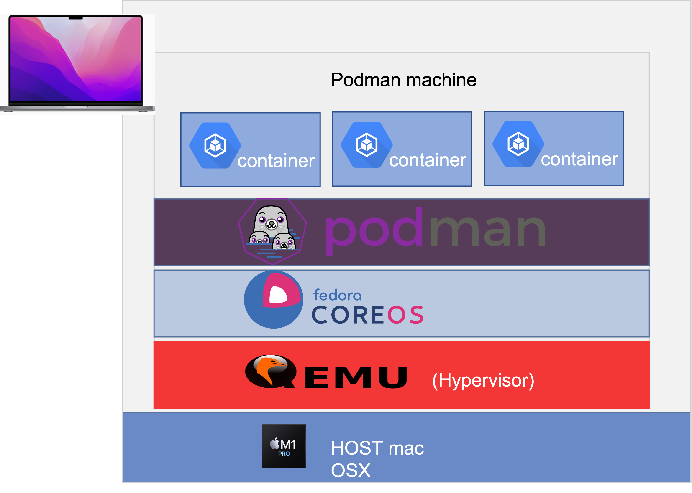

# Run SonarQube in a container on a ARM-based Mac

As of November 2022, the official Docker image for SonarQube does not support the AArch64 architecture (arm64) as used for instance on Apple MacBook with an M1 chip. 

This article illustrates a workaround for that limitation. 

Podman is used to start a virtual machine that can host your x86_64 or arm64 containers.

> This guide has been tested on an Apple MacBook with an M1 chip but should work similarly well on more recent chips such as the M2

## Introducing Podman

Podman is an alternative solution to the Docker engine that is becoming more and more popular in the containerization world. It is backed by Red Hat, which uses Podman it in Openshift, its Kubernetes distribution.

One of the advantages of Podman is that there is no more daemon. All containers are launched by runC without depending on a single process. Second, Podman was designed with to work hand in hand with Kubernetes. Podman can use the YAML manifests of Kubernetes. Both to launch Pods or generate manifests from an existing Pod. Podman is not capable of building container images. You will need other programs such as Buildah to create container images. This is an intentional choice by the Podman team, who did not design Podman as a monolithic application

Podman replaces the docker command line. The compatibility is such that you can create an alias so that you don’t have to change your habits or even your scripts.

Like Docker, Podman uses specific Linux kernel features to create containers and therefore necessitates a Linux VM on non-Linux machines: *podman machine*

* Podman machine consists of the following components: 

* QEMU plus HVF: Virtualization software

* Fedora CoreOS: The virtualized Linux distribution

* Ignition: Configuration management software for Fedora

* gvisor-tap-vsock: Arranges port mapping from VM to host machine

## Architecture



## Installing Podman

First step you will need to install Homebrew, Homebrew is a command line package manager for macOS. 

To install Homebrew on macOS, you will need to install XCode Command  Line tools and then download the installation script by running:
```
# /bin/bash -c "$(curl -fsSL https://raw.githubusercontent.com/Homebrew/install/master/install.sh)"
```

 Before installing Podman, update the Homebrew formulae:
```
brew update
```
Next, install Podman by running the following command:
```
# arch -arm64 brew install podman
```
Homebrew downloads the necessary dependencies and installs Podman.

## Start Podman

When the installation finishes, prepare the Podman virtual machine by typing:
```
# podman machine init --rootful --disk-size 100 --cpus=4 --memory=6000 

Downloading VM image: fedora-coreos-36.20220806.2.0-qemu.aarch64.qcow2.xz: done  
Extracting compressed file
Image resized.
Machine init complete
To start your machine run:

        podman machine start
#        
```
The system downloads the virtual machine and sets it up.

By default this machine is currently configured  :

in rootless mode

* 1 CPU

* 1 GB of memory

This configuration is not sufficient to run Sonarqube .So I initialized the following parameters in the init command :

* --rootful :  set root permissions

* --disk-size : set disk size

* --cpus: set numbers of cpus (with 2 cpus it works)

* --memory : set memory

See documentation machine-init

All its parameters can be changed, it requires a stop and restart of the **Podman machine**. See documentation .

Enter the following command to start Podman:


