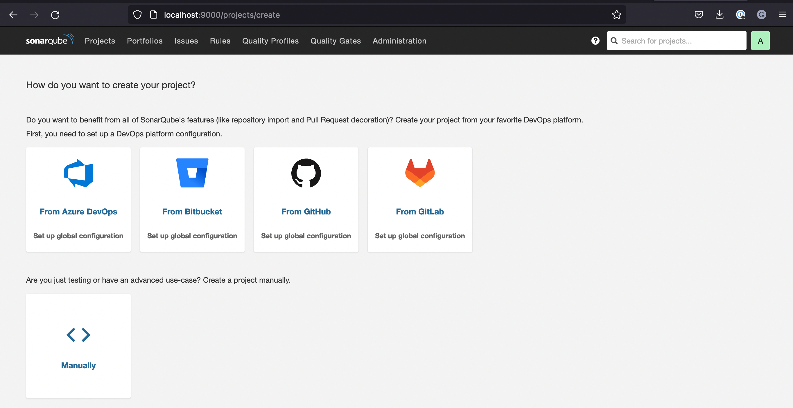
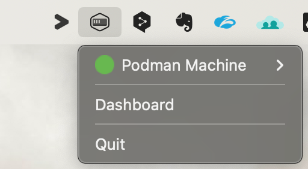

# Run SonarQube in a container on a ARM-based Mac

As of November 2022, the official Docker image for SonarQube does not support the AArch64 architecture (arm64) as used for instance on Apple MacBook with an M1 chip. 

This article illustrates a workaround for that limitation. 

Podman is used to start a virtual machine that can host your x86_64 or arm64 containers.

> This guide has been tested on an Apple MacBook with an M1 chip but should work similarly well on more recent chips such as the M2

## Introducing Podman

Podman is an alternative solution to the Docker engine that is becoming more and more popular in the containerization world. It is backed by Red Hat, which uses Podman it in Openshift, its Kubernetes distribution.

One of the advantages of Podman is that there is no more daemon. All containers are launched by runC without depending on a single process. Second, Podman was designed with to work hand in hand with Kubernetes. Podman can use the YAML manifests of Kubernetes. Both to launch Pods or generate manifests from an existing Pod. Podman is not capable of building container images. You will need other programs such as Buildah to create container images. This is an intentional choice by the Podman team, who did not design Podman as a monolithic application

Podman replaces the docker command line. The compatibility is such that you can create an alias so that you don’t have to change your habits or even your scripts.

Like Docker, Podman uses specific Linux kernel features to create containers and therefore necessitates a Linux VM on non-Linux machines: *podman machine*

* Podman machine consists of the following components: 

* QEMU plus HVF: Virtualization software

* Fedora CoreOS: The virtualized Linux distribution

* Ignition: Configuration management software for Fedora

* gvisor-tap-vsock: Arranges port mapping from VM to host machine

## Architecture


## Installing Podman

First step you will need to install Homebrew, Homebrew is a command line package manager for macOS. 

To install Homebrew on macOS, you will need to install XCode Command  Line tools and then download the installation script by running:
```
# /bin/bash -c "$(curl -fsSL https://raw.githubusercontent.com/Homebrew/install/master/install.sh)"
```

 Before installing Podman, update the Homebrew formulae:
```
brew update
```
Next, install Podman by running the following command:
```
# arch -arm64 brew install podman
```
Homebrew downloads the necessary dependencies and installs Podman.

## Start Podman

When the installation finishes, prepare the Podman virtual machine by typing:
```
# podman machine init --rootful --disk-size 100 --cpus=4 --memory=6000 

Downloading VM image: fedora-coreos-36.20220806.2.0-qemu.aarch64.qcow2.xz: done  
Extracting compressed file
Image resized.
Machine init complete
To start your machine run:

        podman machine start
#        
```
The system downloads the virtual machine and sets it up.

By default this machine is currently configured  :

in rootless mode

* 1 CPU

* 1 GB of memory

This configuration is not sufficient to run Sonarqube .So I initialized the following parameters in the init command :

* --rootful :  set root permissions

* --disk-size : set disk size

* --cpus: set numbers of cpus (with 2 cpus it works)

* --memory : set memory

See documentation machine-init

All its parameters can be changed, it requires a stop and restart of the *Podman machine*. See documentation .

Enter the following command to start Podman:

```
# podman machine start

Starting machine "podman-machine-default"
Waiting for VM ...
Mounting volume...

Machine "podman-machine-default" started successfully
#

```
The output confirms the system started the Podman machine successfully.

Podman, like others, is based on a configuration file called containers.conf and is located in ~/.config/containers. It allows, in particular, to position some paths.

To verify, you can ssh into the VM and set kernel parameters needed for Sonarqube using:

```
# podman machine ssh

Connecting to vm podman-machine-default. To close connection, use `~.` or `exit`                                                                                                               
Fedora CoreOS 36.20220806.2.0                                                                                                                                                                  
Tracker: https://github.com/coreos/fedora-coreos-tracker                                                                                                                                       
Discuss: https://discussion.fedoraproject.org/tag/coreos                                                                                                                                                                                                                                                                            
[root@localhost ~]#
```
and then check the podman version installed inside the VM:
```
[root@localhost ~]# podman version

Client:       Podman Engine
Version:      4.2.0
API Version:  4.2.0
Go Version:   go1.18.5
Built:        Wed Aug 10 22:46:05 2022
OS/Arch:      darwin/arm64

Server:       Podman Engine
Version:      4.1.1
API Version:  4.1.1
Go Version:   go1.18.4
Built:        Fri Jul 22 21:06:49 2022
OS/Arch:      linux/arm64
[root@localhost ~]#
```
Show Podman machine run:
```
# podman machine list                                                                                                     
NAME                    VM TYPE     CREATED     LAST UP            CPUS        MEMORY      DISK SIZE                                                                                           
podman-machine-default  qemu        4 days ago  Currently running  4           5.243GB     107.4GB
#
#
```
Aliasing Docker with Podman

Force of habit (or other scripts) may have you calling docker. To work around this:
```
# alias docker=podman
```
Pull container image

    Let’s try to pull a SonarQube image:
```
$ podman pull --arch=amd64 sonarqube:9.7.1-enterprise
```
    Let's check that the image is the right one:
```
# podman image ls                                                                                                                        
REPOSITORY                   TAG               IMAGE ID      CREATED     SIZE                                                                                                                  
docker.io/library/sonarqube  9.7.1-enterprise  41da366347d9  9 days ago  657 MB 
#                                                                                                 
```
    Create three external volumes using the following commands:
```
# podman volume create sonarqube_data
# podman volume create sonarqube_logs
# podman volume create sonarqube_extensions

Make sure that the volumes were created:
# podman volume ls                                                                                                                       
DRIVER      VOLUME NAME                                                                                                                                                                        
local       sonarqube_data
local       sonarqube_logs
local       sonarqube_extensions
# 
```
Running  SonarQube container

Don't forget to set the Linux kernel parameters for SonarQube: 
```
# podman machine ssh

Connecting to vm podman-machine-default. To close connection, use `~.` or `exit`                                                                                                               
Fedora CoreOS 36.20220806.2.0                                                                                                                                                                  
Tracker: https://github.com/coreos/fedora-coreos-tracker                                                                                                                                       
Discuss: https://discussion.fedoraproject.org/tag/coreos                                                                                                                                                                                                                                                                            
[root@localhost ~]# echo "vm.max_map_count = 524288" >> /etc/sysctl.d/99-sysctl.conf
[root@localhost ~]# echo "fs.file-max = 131072" >> /etc/sysctl.d/99-sysctl.conf
logout
Connection to localhost closed.
[root@localhost ~]# 
[root@localhost ~]# sysctl -w vm.max_map_count=524288
[root@localhost ~]# sysctl -w fs.file-max=131072
[root@localhost ~]#
```
To set these values more permanently, you must update either /etc/sysctl.conf to reflect these values:
```
vm.max_map_count=524288
fs.file-max=131072
```
In this case, the PostgreSQL database resides outside of the local container directly on the OS (I do not detail the installation of PostgreSQL in this document).

To access the PostgreSQL database outside the container you will need to enter the local IP address of your Mac desktop and pass the parameter for the container run: 

**--add-host=hostname:Desktop_ip_address**

This flag can be used to add additional lines to /etc/hosts.If a container is connected to the default bridge network and linked with other containers, then the container’s /etc/hosts file is updated with the linked container’s name.

Running Sonarqube :
```
# podman run --name sonarqube9 --rm -p 9000:9000 -e SONAR_JDBC_URL=jdbc:postgresql://10.150.121.110:5432/sonarqube09 \
-e SONAR_JDBC_USERNAME=sonarcont -e SONAR_JDBC_PASSWORD=xxxx \
-e SONAR_SEARCH_JAVAADDITIONALOPTS="-Dbootstrap.system_call_filter=false" \
-v sonarqube_data:/opt/sonarqube/data -v sonarqube_extensions:/opt/sonarqube/extensions -v sonarqube_logs:/opt/sonarqube/logs -e SONAR_SEARCH_JAVAADDITIONALOPTS="-Dbootstrap.system_call_filter=false" --add-host=database:10.150.121.110 41da366347d9
.............
.............
2022.08.22 11:30:24 INFO  ce[][o.s.c.c.CePluginRepository] Load plugins
2022.08.22 11:30:32 INFO  ce[][o.s.c.c.ComputeEngineContainerImpl] Running Enterprise edition
2022.08.22 11:30:33 INFO  ce[][o.s.s.e.CoreExtensionBootstraper] Bootstrapping Governance
2022.08.22 11:30:33 INFO  ce[][o.s.s.e.CoreExtensionBootstraper] Bootstrapping Governance (done) | time=36ms
2022.08.22 11:30:33 INFO  ce[][o.s.ce.app.CeServer] Compute Engine is started
2022.08.22 11:30:33 INFO  app[][o.s.a.SchedulerImpl] Process[ce] is up
2022.08.22 11:30:33 INFO  app[][o.s.a.SchedulerImpl] SonarQube is operational
``` 

After a few minutes the container is up 😀



## Useful

If you want to access the volumes, to see the logs or other ... you can connect to the Podman machine and mount the desired volume.

Example with logs volume :

# podman machine ssh

Connecting to vm podman-machine-default. To close connection, use `~.` or `exit`                                                                                                               
Fedora CoreOS 36.20220806.2.0                                                                                                                                                                  
Tracker: https://github.com/coreos/fedora-coreos-tracker                                                                                                                                       
Discuss: https://discussion.fedoraproject.org/tag/coreos                                                                                                                                                                                                                                                                            
[root@localhost ~]# podman volume list

# 
DRIVER      VOLUME NAME                                                                                                                                                                        
local       sonarqube_data
local       sonarqube_logs
local       sonarqube_extensions
#
# podman volume mount sonarqube_logs
/var/lib/containers/storage/volumes/sonarqube_logs/_data
#
# ls /var/lib/containers/storage/volumes/sonarqube_logs/_data
access.log  ce.log  es.log  sonar.log  web.log
#

To unmount the volume place the following command :
                                                                                                                                           
# podman volume unmount sonarqube_logs                                                                                          
sonarqube_logs
#
Next

If you want to manage different container engines from a single UI and tray icon… 

You can install Podman Desktop which allows you to easily work with containers from your local environment. Podman Desktop is built on Podman Engine. It is a familiar desktop graphical interface for the free and open container manager.

![sonargui, sonarqui(podmangui.png)

